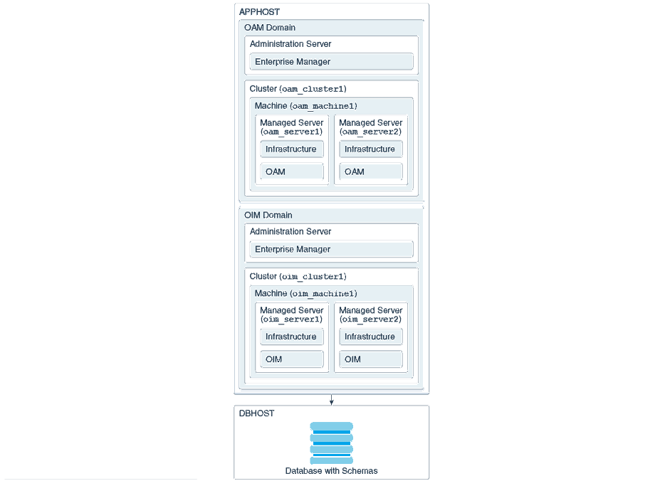
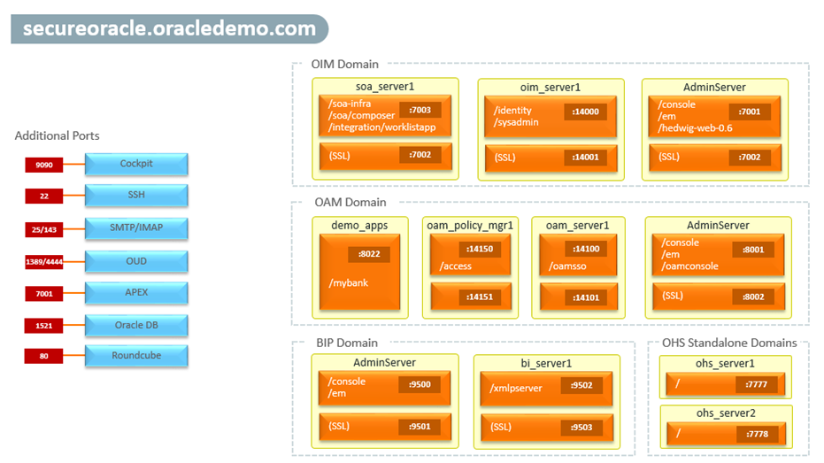

# Workshop Introduction and Overview                                    

The labs in this workshop walk you through all the steps to get started using the **Oracle IAM Suite 12c R2 PS4 (12.2.1.4.0)**. You will demonstrate employee lifecycle management, identity certifications, hybrid cases for access managements, RESTful APIs for identity governance and OAuth management.

The Oracle IAM Suite provides a unified, integrated security platform designed to manage user lifecycle and provide secure access across the enterprise resources, both within and beyond the firewall and into the cloud.

## What is SecureOracle?
SecureOracle represents a demonstration platform for the **Oracle IAM Suite 12c R2 PS4 (12.2.1.4.0)** which includes the following Oracle components:

* Identity Governance:
	* OIG 12c, SOA Suite 12c, BI Publisher 12c, OUD 12c, DB 19c and 12c Connectors
* Access Management:
	* OAM 12c, OHS/WebGate 12c, OUD 12c and DB 19c
* Development Tools and Assets:
	* [JDeveloper 12c with SOA Extensions](http://www.oracle.com/technetwork/middleware/soasuite/downloads/index.html), [SQL Developer 19.2.1](https://www.oracle.com/database/technologies/appdev/sql-developer.html), [Apache Studio 2](https://directory.apache.org/studio/) and [Oracle APEX 19.2](https://apex.oracle.com/en/)
	* Sample My HR and My IGA Applications and Demo Scenarios

**Note:** OIM and OIG are interchangeable terms and refer to the same product Oracle Identity Manager or Oracle Identity Governance.

SecureOracle v8.0 can be combined with Oracle Identity Cloud Service (IDCS) to showcase a hybrid identity management environment. When integrated with IDCS, the OIG component offers provisioning and governance services while IDCS provides access management services to cloud and on-prem applications.

The Oracle IAM Suite 12c R2 PS4 can be deployed using the Oracle IAM standard installation topology which is flexible and can be use as a starting point in production environments. The [Figure 1](#image-01) depicts a standard WebLogic Server domain that contains an Administration Server and one or more clusters containing one or more Managed Servers.

Figure 1. Standard Topology for Oracle Identity and Access Management

The [Figure 2](#image-01) depicts the domains that make up the SecureOracle v8.0 environment. The OIG and OAM components can be started individually or all together, and with further configuration these can be integrated following the official documentation [integrating OIG and OAM](https://docs.oracle.com/en/middleware/idm/suite/12.2.1.4/integrate.html) available online.

Figure 2. SecureOracle - Demonstration Platform for IAM Suite 12c R2 PS4

By default all non-SSL ports are used to demonstrate the different use cases, however you can enable SSL ports as needed to meet specific demo requirements. Please refer to the product documentation for details in how to enable SSL. 

## Workshop Objectives
- Get comfortable with Oracle's public cloud services
- Start the SecureOracle demonstration environment
- Walkthrough Oracle's IAM Suite 12c R2 PS4 (12.2.1.4.0) components
- Access the different administrative consoles and sample applications

## Lab Breakdown
- **Lab 1:** Log in to Oracle Cloud and access the SecureOracle environment.
- **Lab 2:** Getting Started with SecureOracle.

**After reading the following workshop prerequisites, get started by clicking Lab 1 in the Contents menu on the right.**

## Workshop Prerequisites
This workshop requires an Oracle Cloud account. As a result of registering for LiveLabs, you will receive an email with instructions for accessing your account.

###Getting Help During This Workshop
If you have a question during this workshop then use the <a href="https://cloudcustomerconnect.oracle.com/resources/d9b657b850/summary" target="\_blank">**Identity Forum**</a> on **Cloud Customer Connect** to post questions, connect with experts, and share your thoughts and ideas about Oracle Identity products.

Are you are completely new to the **Cloud Customer Connect**</a> forums? Visit our <a href="https://cloudcustomerconnect.oracle.com/pages/1f00b02b84" target="\_blank">**Getting Started forum page**</a> to learn how to best leverage community resources.

**You are all set; let's begin! Click Lab 1 in the Contents menu on the right.**

## Want to Learn More About Identity and Access Management?

Use these links to get more information about Oracle Identity and Access Management:

- <a href="https://docs.oracle.com/en/middleware/idm/suite/12.2.1.4/index.html" target="\_blank">Oracle Identity Management website</a>
- <a href="https://docs.oracle.com/en/middleware/idm/identity-governance/12.2.1.4/index.html" target="\_blank">Oracle Identity Governance Documentation</a>
- <a href="https://docs.oracle.com/en/middleware/idm/access-manager/12.2.1.4/books.html" target="\_blank">Oracle Access Management Documentation</a>

## Acknowledgements

- **Author** - Ricardo Gutierrez, Solution Engineering - Security and Management
- **Last Updated By/Date** - Ricardo Gutierrez, June 2020

See an issue?  Please open up a request [here](https://github.com/oracle/learning-library/issues).  Please include the workshop name and lab in your request.
